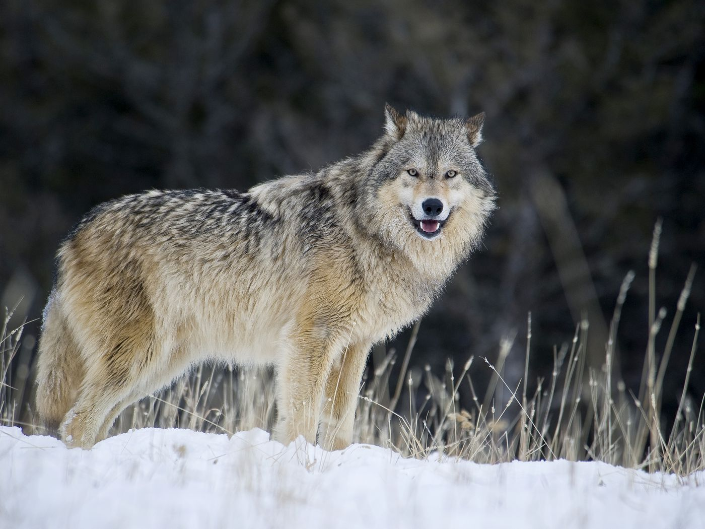

```{r setup, include=FALSE}
knitr::opts_chunk$set(echo = FALSE)
```

## Who is Chad Jenkins?

- Hi, my name is Chad Jenkins!
  - Born May 2nd, 1989 in Lincoln, NE
  - Husband of 9 yrs, father of 3
  - Employed as Dairy Nutritionist
  - Ph.D. candidate in Animal Science
    -Anticipated graduation date: August 2022
    
## Chad's favorite animal



## Chad's favorite plot

```{r, echo = FALSE, message = FALSE}
library(readr)
library(ggplot2)
library(scales)

cocktails <- readr::read_csv('https://raw.githubusercontent.com/rfordatascience/tidytuesday/master/data/2020/2020-05-26/cocktails.csv')
ggplot(data = cocktails, mapping = aes(x = ingredient_number), stat = "count") +
  geom_histogram() +
  ggtitle("Cocktail Complexity") +
  xlab("Number of Ingredients Required") +
  ylab("Number of Cocktail Recipes") +
  scale_x_continuous(breaks=pretty_breaks())

```

## Link to Chad's CV


